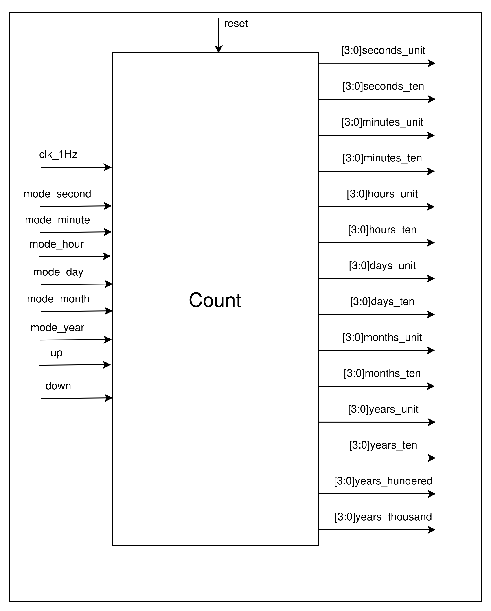
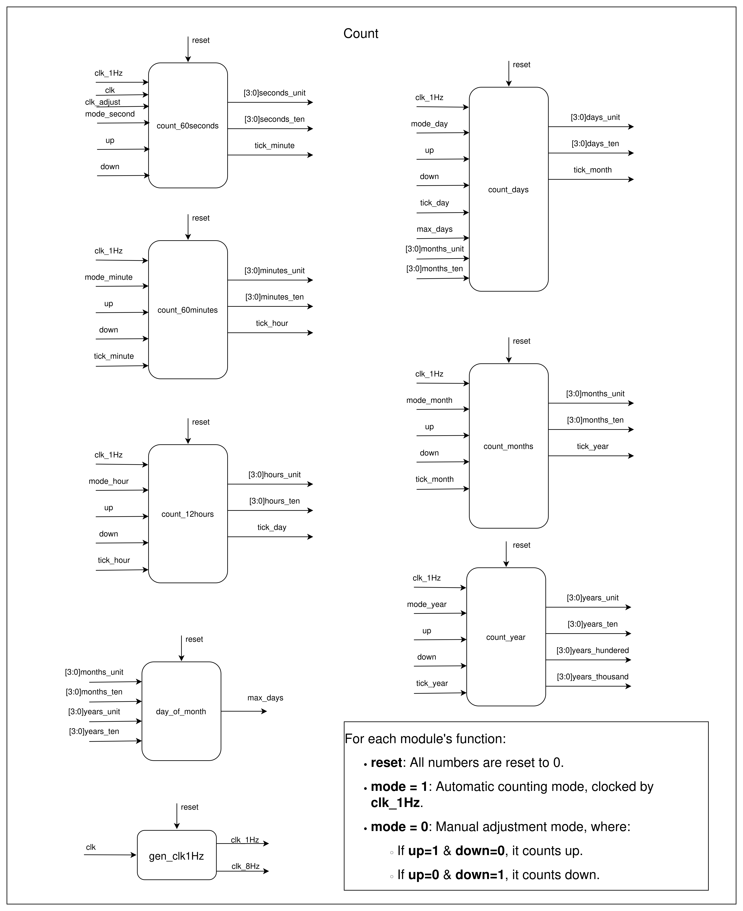
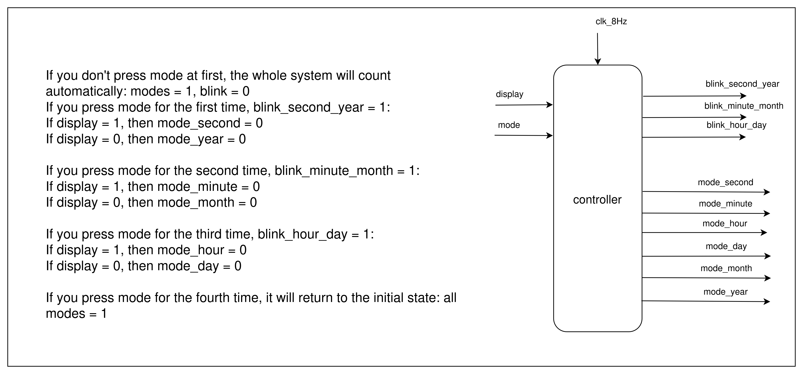
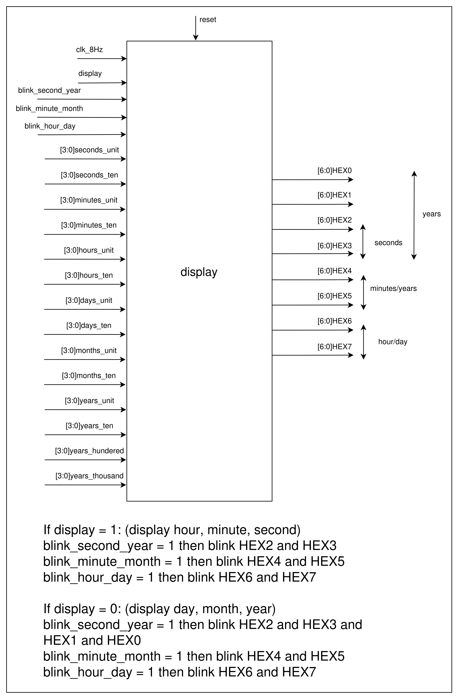

# 🕒 Digital Clock on FPGA DE2-115

## 📘 Introduction

This project implements a **multi-function digital clock** on the **FPGA DE2-115 development board**.  
The system is capable of **counting and displaying time (hours, minutes, seconds)** as well as **date (day, month, year)**.  
All information is shown on the **7-segment LEDs** of the board.

The user can **switch between two display modes**:

1. **Time display mode:** Hour – Minute – Second  
2. **Date display mode:** Day – Month – Year  

The clock runs **automatically** using a 1Hz clock signal and also allows **manual adjustment** of each time or date field using push buttons.

---

## ⚙️ Main Features

- Display **hours, minutes, seconds, day, month, and year** on 7-segment LEDs.  
- **Switch between display modes** via a button.  
- **Manual time adjustment** using push-button cycles:

  - **1st press:** Adjust seconds or year.  
  - **2nd press:** Adjust minutes or month.  
  - **3rd press:** Adjust hours or day.  
  - **4th press:** Return to automatic counting mode.  

- **Blinking indication** helps the user recognize which field is currently being edited.

---

## 🧩 System Overview

The system operates based on a set of control and counting modules.  
---

### 1. Operating Modes (`mode` signal)

- `mode = 1`: Automatic counting mode — time updates every second using `clk_1Hz`.  
- `mode = 0`: Manual adjustment mode.

  - `up = 1`, `down = 0`: Increase value.  
  - `up = 0`, `down = 1`: Decrease value.

---

### 2. System Architecture

The system consists of four main modules:

- **`Count` Module:** Handles counting and manual adjustment of time/date values.  
  

- **`Count - more details` Module:** Handles counting and manual adjustment of time/date values.  
  

- **`Controller` Module:** Manages display mode, blinking signal, and field selection.  
  

- **`Display` Module:** Controls the 7-segment LEDs and formats data for visualization.  
  

- **`gen_clk1Hz` Module:** Generates a 1Hz clock signal from the 50MHz system clock.

Each time field (seconds, minutes, hours, day, month, year) is managed by an independent counter module,  
which receives the clock and control signals and outputs the corresponding display values.

---

## 💡 Display Operation

### 🕔 When in **Time Display Mode (Hour – Minute – Second):**

- `HEX2` & `HEX3`: Seconds  
- `HEX4` & `HEX5`: Minutes  
- `HEX6` & `HEX7`: Hours  
- The field being edited will **blink** on the display.

### 📅 When in **Date Display Mode (Day – Month – Year):**

- `HEX0` & `HEX1`: Day  
- `HEX4` & `HEX5`: Month  
- `HEX6` & `HEX7`: Year  
- The field being edited will **blink** on the display.

---

## 🧭 User Guide

1. **Reset the system:** All values return to 0.  
2. **Default mode:** The clock runs automatically in real time.  
3. **Switch display mode:**  
   - Toggle between “Time” and “Date” modes using the display-mode button.  
4. **Adjust time/date manually:**  
   - 1st press: Adjust seconds or year.  
   - 2nd press: Adjust minutes or month.  
   - 3rd press: Adjust hours or day.  
   - 4th press: Return to automatic mode.

---

## 🔌 Signal Description

| Signal Name                      | Function                                 |
| -------------------------------- | ---------------------------------------- |
| `clk_1Hz`                        | 1Hz clock signal (drives seconds count)  |
| `reset`                          | Resets all time/date fields to 0         |
| `up`, `down`                     | Increase or decrease adjustment inputs   |
| `mode_second`, `mode_minute`, …  | Selects the corresponding time module    |
| `display`                        | Selects display mode (time/date)         |
| `blink_*`                        | Indicates which field is being edited    |

---

## ⚙️ Implementation Details

- **Board:** Altera/Intel DE2-115 (Cyclone IV FPGA)  
- **Hardware Description Language:** Verilog HDL  
- **Design Environment:** Intel Quartus Prime  
- **Input Clock Frequency:** 50 MHz (divided to 1 Hz for counting)

---

## 🚀 Future Improvements

- Add **alarm clock functionality**.  
- Integrate **external RTC (Real-Time Clock)** module for persistent timekeeping.  
- Support **12-hour / 24-hour display mode switching**.  
- Replace 7-segment display with **LCD or OLED interface**.  

---

## 👨‍💻 Author

- **Student:** Nguyen Viet Hung  
- **University:** Hanoi University of Science and Technology (HUST)  
- **Major:** Electronics and Telecommunications Engineering  

---

## 🧾 Version Information

- **Design Language:** Verilog HDL  
- **Last Updated:** October 2025  
